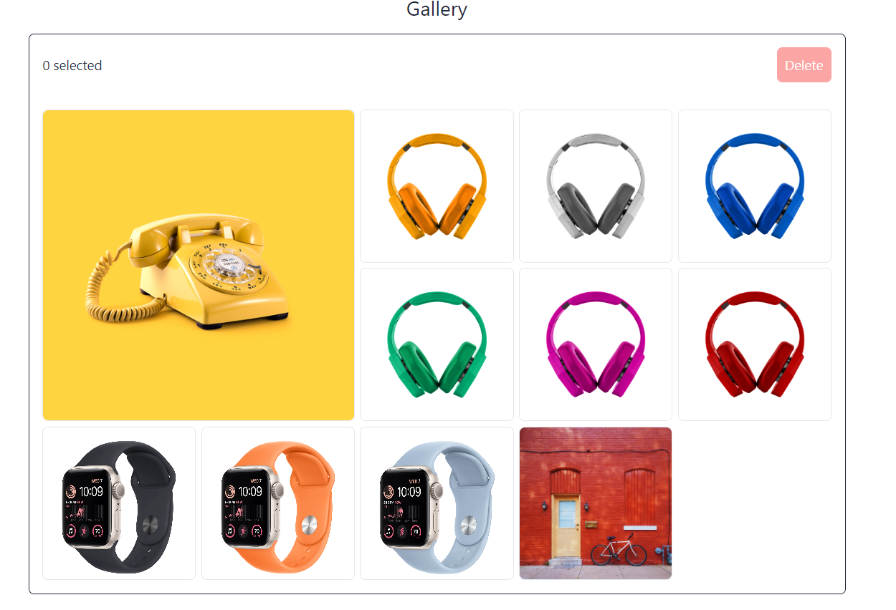
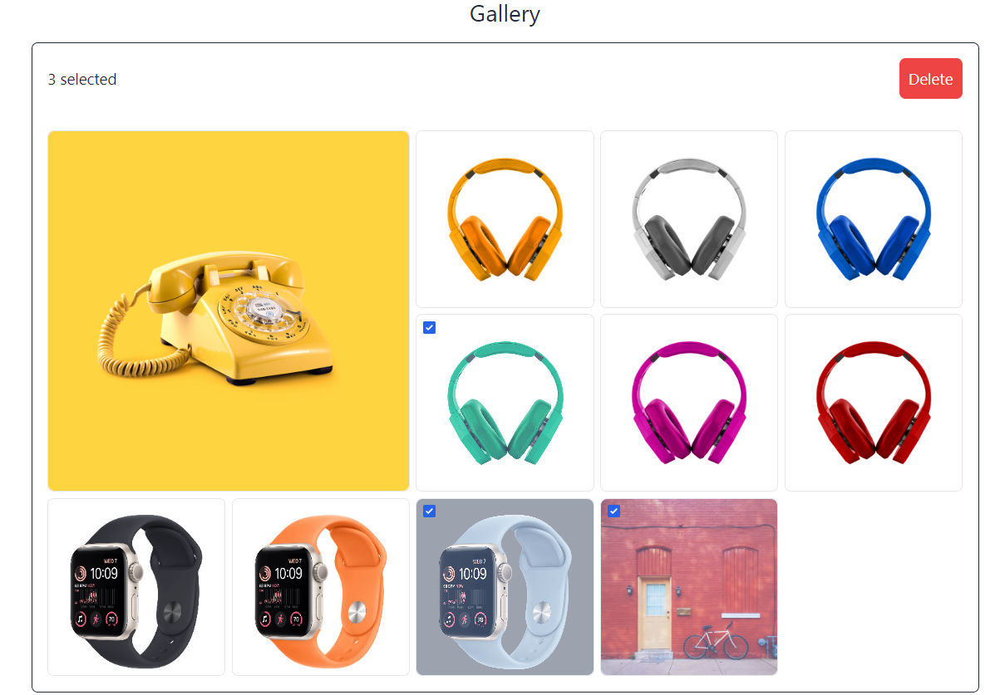

# React Gallery

Fully responsive grid style sortable gallery made in react. Users can drag and drop to sort images in grid style layout. Images can be deleted and selected in real time.

## Screenshots





# Run Locally

To run the project on local development server clone the repository with the following command and then going into the cloned directory

```bash
git clone https://github.com/Anindra123/ReactGallery.git

cd ReactGallery
```

Then run the folllowing command and go to `http://localhost:5173` to see the website running on the development server

```bash
npm run
```

# Dependencies

- [Sortable JS v1.15.0](https://sortablejs.github.io/Sortable/)

- [TailwindCSS v3.3.5](https://tailwindcss.com/docs/installation)

- [TailwindCSSForm](https://tailwindcss-forms.vercel.app/)
